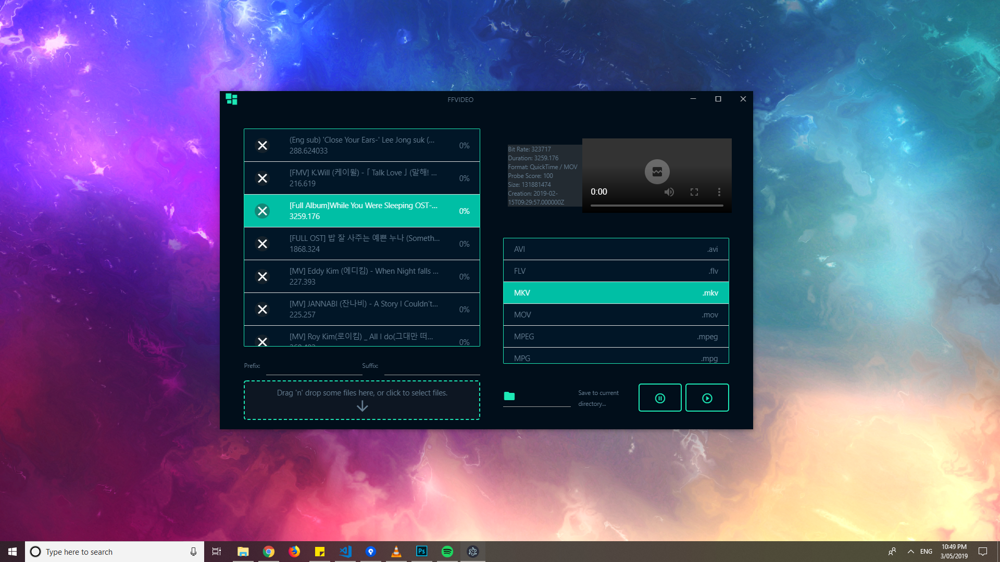

# FFVideo
Video converter app made with Electron + React + Redux + FFmpeg. Just drag your files, click start, and you're good to go. It supports a ton of video formats and also includes video resizing, and audio extraction. Windows, Linux, and Mac are supported.

## Setup

Clone the repo and cd into the directory.

```
git clone https://github.com/jnpco/FFVideo.git
cd FFVideo
```
### Demo


## Usage

*You must have node installed on your local machine.*

1. `npm install` to download node modules.
2. run `npm run electron-dev` to start react server port 3000 and electron concurrently.
 - or you could run `npm start` then `npm run electron` to start them separately.

Just drag all your files and instantly convert all of them to the desired video/audio format.

## Production

N/A

- [ ] Implement convert queue.
- [ ] Implement covert pause.
- [ ] Implement convert stop.
- [ ] Implement other codec convertion.
- [ ] Implement video resolution selection.
- [ ] Implement redux, to manage state better.
- [ ] Refactor css.
